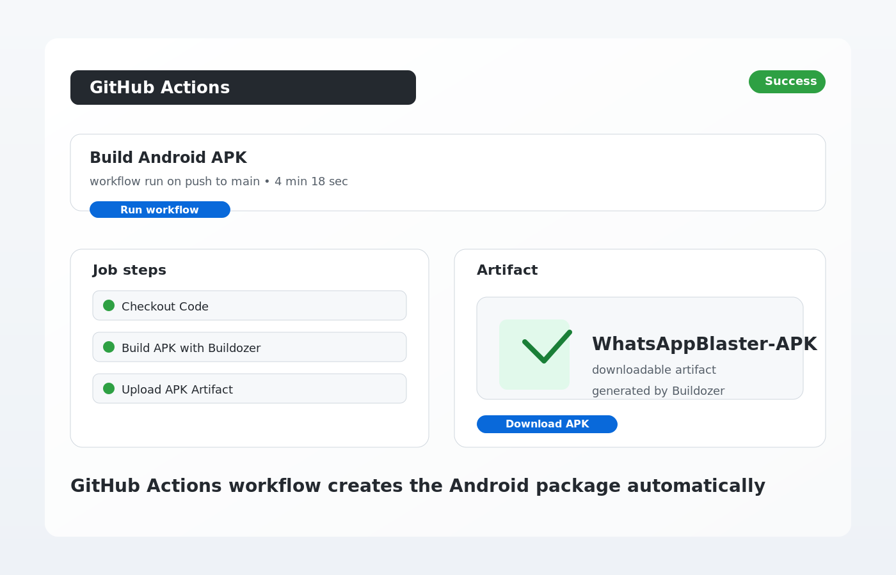

# WhatsApp Blaster APK

This project contains a Kivy Android app that lets a user:

- select an Excel file with phone numbers
- optionally choose a media file
- type a WhatsApp message
- send bulk WhatsApp messages from an Android device

The repository also includes a GitHub Actions workflow and Buildozer config to compile the app into an APK automatically.

## Project Files

- `main.py` – main app logic
- `buildozer.spec` – Android build configuration for Buildozer
- `setup_github_repo.py` – helper to create/push the GitHub repo and upload project files
- `.github/workflows/build.yml` – GitHub Actions workflow that builds the APK
- `README.md` – project overview and build instructions

## How the APK Build Works

The workflow in `.github/workflows/build.yml` runs in GitHub Actions on every push to `main` or `master`, or when you trigger it manually.

### Workflow steps

1. Checkout repository
   - `actions/checkout@v4` downloads the repo contents into the runner.

2. Build the Android APK
   - `ArtemSBulgakov/buildozer-action@v1` runs Buildozer inside the GitHub-hosted Ubuntu environment.
   - Buildozer reads `buildozer.spec` and compiles the Kivy app for Android.
   - It installs required build dependencies, prepares the Android SDK/NDK, and generates the APK package.

3. Upload artifact
   - `actions/upload-artifact@v4` saves the generated APK as a downloadable GitHub Actions artifact.

### Workflow file

```yaml
name: Build Android APK

on:
  push:
    branches: [ "main", "master" ]
  workflow_dispatch:

jobs:
  build:
    runs-on: ubuntu-latest

    steps:
      - name: Checkout Code
        uses: actions/checkout@v4

      - name: Build APK with Buildozer
        uses: ArtemSBulgakov/buildozer-action@v1
        id: buildozer
        with:
          repository_root: .
          workdir: .
          buildozer_version: stable

      - name: Upload APK Artifact
        uses: actions/upload-artifact@v4
        with:
          name: WhatsAppBlaster-APK
          path: ${{ steps.buildozer.outputs.filename }}
```

## What Buildozer Uses

The `buildozer.spec` file defines the Android package metadata and dependencies:

```ini
[app]
title = WhatsApp Blaster
package.name = whatsappblaster
package.domain = org.automation
source.dir = .
source.include_exts = py,png,jpg,kv,atlas

version = 0.1
requirements = python3,kivy,pandas,openpyxl,pyjnius

orientation = portrait
fullscreen = 0
android.permissions = READ_EXTERNAL_STORAGE, WRITE_EXTERNAL_STORAGE, MANAGE_EXTERNAL_STORAGE, INTERNET

android.api = 33
android.minapi = 21
android.ndk = 25b
android.archs = arm64-v8a, armeabi-v7a
android.accept_sdk_license = True
```

This tells Buildozer:

- the app is a Kivy app
- it depends on `kivy`, `pandas`, and `pyjnius`
- the APK should target Android API 33
- it has the storage and internet permissions required by the app

## Run the Build Locally or in GitHub Actions

### Option 1: Trigger from GitHub

1. Push the repo to GitHub
2. Open the repository in GitHub
3. Click the Actions tab
4. Select the workflow named `Build Android APK`
5. Click `Run workflow` or wait for automatic push-triggered execution
6. Download the APK artifact from the completed run

### Option 2: Build on a local Linux machine

Install Buildozer and its dependencies, then run:

```bash
buildozer android debug
```

That command creates a debug APK in the `bin/` directory.

## Example Excel Input

Your Excel file needs a `Phone` column, for example:

| Phone |
|---|
| 15551234567 |
| 15557654321 |

The app strips non-digit characters and uses each number as a WhatsApp target.

## Local Validation

This workspace was validated with:

```bash
python -m py_compile main.py setup_github_repo.py
```

This confirms the Python files compile successfully before packaging.

## GitHub UI Walkthrough

To build the APK in GitHub Actions:

1. Open the repository on GitHub.
2. Click the `Actions` tab near the top of the page.
3. Select the workflow named `Build Android APK`.
4. Click `Run workflow` if you want to trigger it manually.
5. Wait for the job to finish; GitHub will show the workflow run and step-by-step logs.
6. When the run succeeds, open the job summary and download the APK artifact from the `Artifacts` section.

### Build flow diagram

This diagram shows the GitHub Actions process used to generate the Android package:



## Important Notes

- This project is intended for educational and automation use.
- Bulk WhatsApp messaging has legal and platform-policy implications.
- Use it responsibly and only with appropriate consent.
- This app depends on Android permissions and external app integrations, so real-device testing is required for full functionality.
